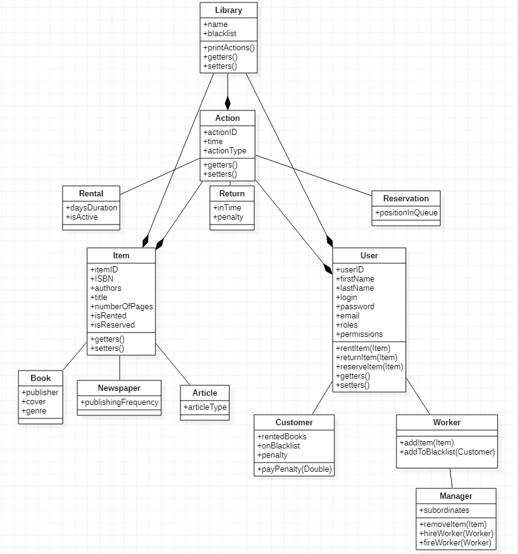

  
## Basic Overview

 Simple program in java to simulate and manage real library resources for workers. Using this app you can hire/fire employees, view stats about rented books, show info about customers and more! 

## Rules and regulations :page_with_curl:
- User can rent an item for a month.
- User can rent 5 items at the time.
- If a user exceeds 100.00 penalty they are added to the black list.
- User can get out of  the black list by paying a penalty.
- For every day of delay penalty is 1.00.

## Project Structure

## Contributors :handshake:
    
    
   :whale: Jakub Frączek [machnikovsky](https://github.com/machnikovsky)  
   :ringed_planet: Jakub Wojtaś [CodeByJacob](https://github.com/CodeByJacob)  
  ✨ Weronika Kłeczek [weronikakleczek](https://github.com/weronikakleczek)  
  :turtle: Wojciech Jacoszek [Diluted128](https://github.com/Diluted128)
  

